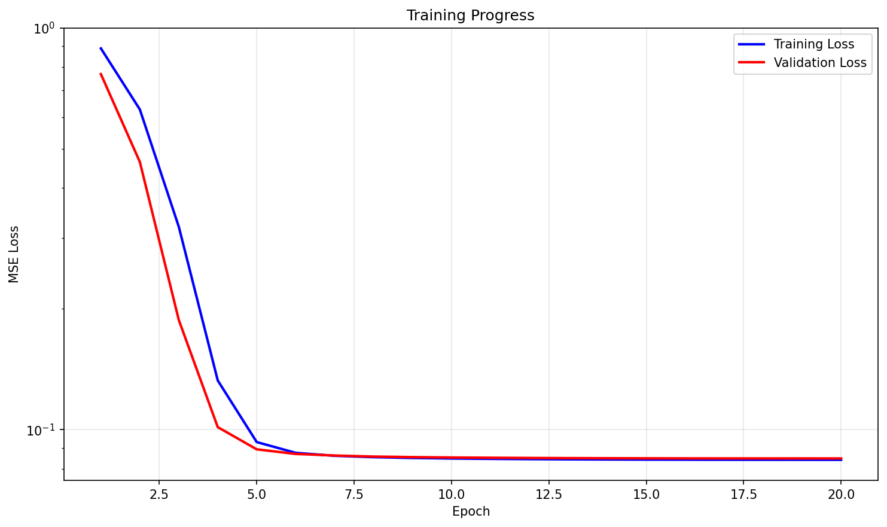
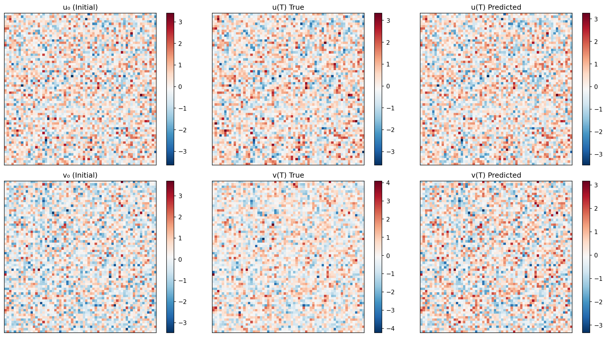

# Fourier-Neural-Operator-for-2D-Burgers-equation

This repository demonstrates how to solve the **2D Burgers’ equation** using the **Fourier Neural Operator (FNO)**.  
It provides a simple, end-to-end pipeline for:

- Generating synthetic training data by numerically solving the PDE,  
- Training an FNO model to learn the operator mapping from initial condition → solution at a later time,  
- Evaluating and visualizing predictions.

---

## 🌀 Background

The **2D vector Burgers’ equation** is a canonical nonlinear PDE in fluid dynamics:

$$
\frac{\partial u}{\partial t} + u\frac{\partial u}{\partial x} + v\frac{\partial u}{\partial y} = \nu(\frac{\partial^{2} u}{\partial x^{2}} + \frac{\partial^{2} u}{\partial y^2})
$$
$$
\frac{\partial v}{\partial t} + u\frac{\partial v}{\partial x} + v\frac{\partial v}{\partial y} = \nu(\frac{\partial^{2} v}{\partial x^{2}} + \frac{\partial^{2} v}{\partial y^2})
$$

$$
u_t + u u_x + v u_y = \nu \Delta u, \quad
v_t + u v_x + v v_y = \nu \Delta v
$$

It is widely used as a simplified model to test numerical solvers and machine learning approaches for PDEs.

**Fourier Neural Operators (FNOs)** (Li et al., 2020) learn mappings between function spaces using global convolutions in the Fourier domain, making them highly effective for PDE solution operators.

---

## 📂 Repository Structure
```
├── burgers_fno.ipynb # Main training & evaluation jupiter script
├── artifacts/ # Saved model weights & plots
├── LICENCE # MIT Licence for the project
└── README.md # Project description (this file)
```

---

## 🚀 Getting Started
### 1. Clone the repo
```bash
git clone https://github.com/Shubhm1shra/Fourier-Neural-Operator-for-2D-Burgers-equation.git
cd Fourier-Neural-Operator-for-2D-Burgers-equation
```
### 2. Install Dependencies
```bash
pip install -r requirements.txt
```
### 3. Run Training
```bash
python FNO_Burger2D.py
```
This will:
* Generate a synthetic dataset of Burgers’ flows,
* Train the FNO model for a few epochs,
* Save the best model in ./artifacts/fno2d_burgers.pt,
* Save a qualitative comparison plot in ./artifacts/qualitative_comparisions.png.

---

## 📊 Results

After training, you should see:
* Decreasing MSE loss over epochs (training & validation).
* A plot comparing the true vs. predicted velocity field (u-component).

<p float="left">
  
  
</p>

* Left: initial condition ​u0
* Middle: true solution at time 𝑇
* Right: FNO-predicted solution at time 𝑇

---

## ⚙️ Configuration

Key parameters (see ```Config``` class in ```FNO-Burger2D.ipynb```):

* `H`, `W` – grid resolution (default: 64 × 64)
* `train_N`, `val_N` – dataset sizes
* `T`, `steps` – integration horizon and RK4 steps
* `nu` – viscosity
* `modes_x`, `modes_y` – Fourier modes used
* `width`, `layers` – FNO model size
* `epochs`, `batch_size`, `lr`, `weight_decay` – training setup

---

## 🔮 Extensions

This repo is meant as a starting point. Possible directions:
* Autoregressive rollout for long-time predictions.
* Multi-time supervision (predict multiple future times).
* Training on varying viscosities (conditioning on ν).
* Comparing FNO with baseline CNNs or UNets.
* Extending to 2D Navier–Stokes equations.
  
---

📖 References

* Zongyi Li, Nikola Kovachki, Kamyar Azizzadenesheli, et al.
Fourier Neural Operator for Parametric Partial Differential Equations.
NeurIPS 2020. arXiv:2010.08895

---

👤 Author

Developed by [Shubh Mishra](https://github.com/Shubhm1shra).

---
